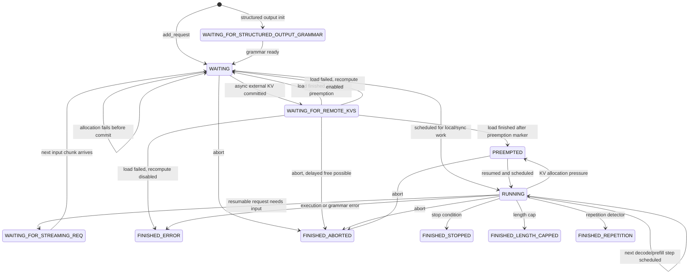
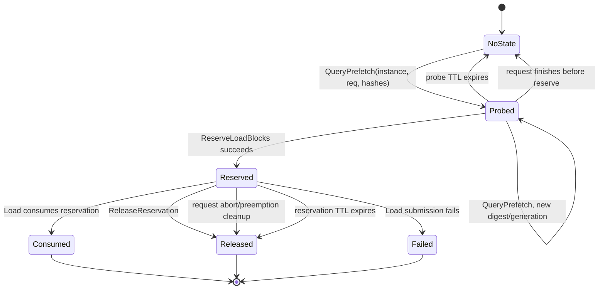

# vLLM Request State Machine Notes

This note summarizes the vLLM V1 scheduler request lifecycle relevant to
PegaFlow's KV connector integration. It focuses on asynchronous KV loading,
preemption, abort handling, and the implications for server-side reservation
state.

The code references below are based on vLLM V1:

- `vllm/v1/request.py`
- `vllm/v1/core/sched/scheduler.py`
- `vllm/distributed/kv_transfer/kv_connector/v1/base.py`
- `vllm/v1/worker/gpu/kv_connector.py`

## Request Statuses

vLLM defines request states in `RequestStatus`:

```text
WAITING
WAITING_FOR_STRUCTURED_OUTPUT_GRAMMAR
WAITING_FOR_REMOTE_KVS
WAITING_FOR_STREAMING_REQ
RUNNING
PREEMPTED
FINISHED_STOPPED
FINISHED_LENGTH_CAPPED
FINISHED_ABORTED
FINISHED_IGNORED
FINISHED_ERROR
FINISHED_REPETITION
```

Any status after `PREEMPTED` is considered finished by
`RequestStatus.is_finished()`.

New requests normally start in `WAITING`. Requests using structured output may
start in `WAITING_FOR_STRUCTURED_OUTPUT_GRAMMAR` until grammar initialization
finishes.

## Scheduler Queues

The scheduler keeps two waiting queues plus a running list:

- `waiting`: schedulable requests, including new and preempted requests.
- `skipped_waiting`: blocked requests that should be revisited later.
- `running`: requests with allocated KV blocks that are actively participating
  in model execution.

Blocked waiting states are:

```text
WAITING_FOR_STRUCTURED_OUTPUT_GRAMMAR
WAITING_FOR_REMOTE_KVS
WAITING_FOR_STREAMING_REQ
```

Blocked requests are placed in `skipped_waiting`. During scheduling, vLLM tries
to promote blocked requests back to a schedulable state before considering new
work.

## Normal Scheduling Flow

The scheduler first schedules existing `RUNNING` requests. It then schedules
requests from `waiting` and `skipped_waiting`.

For a waiting request with `num_computed_tokens == 0`, vLLM performs prefix
cache checks in this order:

1. Local KV cache lookup through `kv_cache_manager.get_computed_blocks()`.
2. External KV lookup through
   `connector.get_num_new_matched_tokens(request, num_new_local_computed_tokens)`.

The connector returns:

```text
(num_external_tokens | None, load_kv_async)
```

`None` means the connector needs more time. The request remains waiting and is
queried again in a later scheduler step. This is why
`get_num_new_matched_tokens()` must tolerate repeated calls for the same request
without committing resources.

After the scheduler computes local and external cached token counts, it calls
`kv_cache_manager.allocate_slots()`. Only after allocation succeeds does vLLM
call:

```python
connector.update_state_after_alloc(request, blocks, num_external_tokens)
```

This is the first point where the connector can treat the scheduler decision as
committed for that step.

## State Transition Diagram

The following diagram captures the request transitions relevant to KV connector
behavior. It omits structured-output and streaming-input details except where
they block normal scheduling.



For a future two-phase PegaFlow reservation protocol, the corresponding resource
lifecycle would be:



## Async KV Load Flow

When `get_num_new_matched_tokens()` returns external tokens with
`load_kv_async=True`, the scheduler:

1. Allocates destination KV blocks with `delay_cache_blocks=True`.
2. Calls `update_state_after_alloc()`.
3. Moves the request to `WAITING_FOR_REMOTE_KVS`.
4. Stores the externally computed token count in `request.num_computed_tokens`.
5. Places the request in `skipped_waiting`.

The request is not runnable while it is in `WAITING_FOR_REMOTE_KVS`.

On the worker side, `pre_forward()` binds connector metadata, calls
`handle_preemptions()`, then starts load through `start_load_kv()`. After the
forward pass, `post_forward()` collects:

```text
finished_sending
finished_recving
invalid_block_ids
```

The scheduler receives this through `update_from_output()`.

When a worker reports `finished_recving`, vLLM records the request ID in
`finished_recving_kv_req_ids`. On a later scheduler pass, promotion of
`WAITING_FOR_REMOTE_KVS` does the following:

- If load succeeded, cache the loaded blocks and move the request to `WAITING`
  or `PREEMPTED`.
- If load failed and recompute recovery is enabled, cache the valid prefix or
  free the allocation, then move the request back to a schedulable state.

For a full external prompt hit, vLLM decreases `num_computed_tokens` by one so
the model recomputes the last token before sampling.

## Load Failure Recovery

The connector reports load failures through
`get_block_ids_with_load_errors()`. The base connector contract says:

- It applies to both sync and async loading.
- For async loading, failed block IDs must be reported no later than the same
  pass where the request ID is returned by `get_finished()`.
- The request must still be reported as finished receiving even when failures
  occur.

The scheduler maps invalid block IDs back to affected requests and truncates
each request to the longest valid prefix:

```text
request.num_computed_tokens = first_invalid_block_index * block_size
```

For async loading, affected requests are tracked in
`failed_recving_kv_req_ids`. When `finished_recving` later promotes the request,
vLLM either caches the valid prefix or frees the allocated destination blocks.

The recovery behavior depends on `recompute_kv_load_failures`:

- Recompute enabled: requests are rescheduled and the invalid suffix is computed
  locally.
- Recompute disabled: affected requests are finished with `FINISHED_ERROR`.

This failure path is a useful fallback for PegaFlow reservation races: a reserve
or load failure can be surfaced as invalid block IDs and vLLM will restore a
correct prefix before retrying or failing the request.

## Preemption

Preemption only applies to `RUNNING` requests. When KV allocation fails for
another request, vLLM may preempt a lower-priority or later-running request.

Preemption does the following:

1. Frees the request's KV cache allocation.
2. Frees encoder cache state.
3. Sets status to `PREEMPTED`.
4. Resets `num_computed_tokens` to `0`.
5. Clears speculative tokens.
6. Increments `num_preemptions`.
7. Prepends the request to `waiting`.

The next successful scheduling pass treats the request as a resumed request and
moves it back to `RUNNING`.

`SchedulerOutput.preempted_req_ids` is sent to workers. The worker-side KV
connector receives it through `handle_preemptions()` before overwritten blocks
are reused. Connectors that perform async saving must use this hook to finish or
flush work that depends on those blocks.

Because preemption resets `num_computed_tokens`, any PegaFlow server-side state
that is keyed by request ID must tolerate a later query for the same request ID
with a different hash slice or generation.

## Abort and Finished Requests

External aborts call:

```python
scheduler.finish_requests(request_ids, RequestStatus.FINISHED_ABORTED)
```

`finish_requests()` removes requests from `running`, `waiting`, and
`skipped_waiting`, sets the finished status, and calls `_free_request()`.

For requests in `WAITING_FOR_REMOTE_KVS`, vLLM may delay freeing KV blocks:

```text
delay_free_blocks = request_id not in finished_recving_kv_req_ids
```

This keeps the request object and blocks alive until async KV transfer finishes.
When `finished_recving` later arrives for an already finished request, vLLM frees
the blocks.

The connector is notified through `request_finished()`. For async connector work,
`request_finished()` may return `True` to delay block freeing until the connector
later reports the request through `finished_sending`.

For PegaFlow, abort handling needs to release server-side reservations that were
created after allocation but not consumed by load. A server-side TTL is still
needed because process failure may prevent an explicit release call.

## Connector Contract Points

The most relevant KV connector methods are:

- `get_num_new_matched_tokens()`: scheduler-side query. vLLM may call it
  multiple times for the same request and expects it to behave like a
  side-effect-free probe. PegaFlow's current one-RPC implementation still pins
  on `QueryPrefetch`, so the connector memoizes uncommitted positive probes to
  avoid repeating that pinning side effect.
- `update_state_after_alloc()`: scheduler-side commit point after KV block
  allocation succeeds.
- `build_connector_meta()`: packages per-step load/save metadata and resets
  connector scheduler-side transient state.
- `handle_preemptions()`: worker-side hook before preempted blocks are
  overwritten.
- `start_load_kv()`: worker-side load submission.
- `get_finished()`: worker-side completion reporting for async save/load.
- `get_block_ids_with_load_errors()`: worker-side failure reporting.
- `request_finished()`: scheduler-side cleanup hook for finished or aborted
  requests.

For a future two-phase PegaFlow protocol, the important split would be:

```text
get_num_new_matched_tokens(): probe only
update_state_after_alloc(): reserve exact load blocks
start_load_kv(): consume reservation and submit load
request_finished()/preemption/release/TTL: clean up unconsumed reservations
```

## Implications for PegaFlow Server-Side State

PegaFlow currently uses the older one-RPC contract where `QueryPrefetch` both
reports prefix hits and pins the hit blocks for the later load. The current
mitigation for repeated scheduler probes is intentionally narrower: the
scheduler-side connector memoizes an uncommitted positive probe for the same
request/hash slice and reuses that result instead of issuing another
`QueryPrefetch`.

The memoized scheduler state has two separate lifetimes:

- Pending query probe: a positive `QueryPrefetch` result that has not yet
  reached `update_state_after_alloc()`. Repeating the same
  `(req_id, computed_blocks, remaining_hashes)` lookup reuses this probe and
  does not call `QueryPrefetch` again.
- Pending query release: an uncommitted probe that the scheduler no longer wants
  to use, but whose compensating `unpin` did not fully succeed. The connector
  retries those releases from later scheduler calls and from shutdown. Each
  release is a single `unpin` RPC that asks the server to release all worker
  refs for each pinned hash; the connector does not issue a new probe for the
  same request ID until the older release is cleared.

When `update_state_after_alloc()` commits an external hit, the connector checks
that the load hashes exactly match the pending probe's pinned hash prefix. The
probe is then transferred to the normal load path and is not unpinned by the
scheduler cleanup path. During connector shutdown, any still-uncommitted
positive probes are released before retrying failed releases.

The current `QueryPrefetch` request already contains:

```text
instance_id
req_id
block_hashes
```

This can identify repeated probes, but request ID alone is not enough. The same
vLLM request can be queried again after preemption or scheduling retry with a
different effective hash slice. A robust server-side key should include:

```text
instance_id + req_id + digest(block_hashes)
```

A cleaner future protocol is:

1. `QueryPrefetch`: probe available prefix and possibly start backing-store
   prefetch. It records lightweight per-request probe state but does not pin.
2. `ReserveLoadBlocks`: called from `update_state_after_alloc()`. It atomically
   re-checks the exact load hashes and pins them all-or-none.
3. `Load`: consumes the reservation and submits the GPU load.
4. `ReleaseReservation`: releases a reservation on abort, preemption, or
   scheduler-side cancellation before load.
5. TTL cleanup: expires stale probe and reserved states.

The gap between probe and reserve is real. Blocks may be evicted after
`QueryPrefetch` and before `ReserveLoadBlocks`. Correct handling is to make
reserve atomic and report failure through vLLM's existing invalid-block/load
failure path. That turns the race into a cache hit-rate loss rather than a
correctness or pin-lifetime bug.

## Future Safety Invariants and Proof Sketch

A future two-phase reservation protocol should preserve the following
invariants.

### Invariant 1: Probe Has No Resource Ownership

`QueryPrefetch` may create or refresh lightweight request state, but it must not
increase pin refcounts or take ownership of cache blocks.

This matches vLLM's contract that `get_num_new_matched_tokens()` may be called
multiple times for the same request. Repeated probe calls can only affect
observability or prefetch progress, not resource lifetime.

### Invariant 2: Reserve Is Atomic

`ReserveLoadBlocks(instance_id, req_id, hashes)` either pins every requested
block or pins none of them.

This avoids partial external-prefix commitments. vLLM has already allocated
destination blocks based on the token count returned earlier, and
`update_state_after_alloc()` cannot reduce that token count. All-or-none reserve
keeps the connector metadata consistent with the scheduler decision.

### Invariant 3: Load Consumes Exactly One Reservation

`Load` must consume an existing matching reservation before it submits GPU work.
After consumption, the reservation is no longer available for another load.

This prevents duplicate consumption and bounds pin lifetime. The load path owns
the block references needed by the transfer task, and the reservation refcount is
released exactly once.

### Invariant 4: Every Reserved State Eventually Terminates

Every reservation must reach one of:

```text
Consumed
Released
Failed
Expired
```

Explicit release handles aborts, preemptions, and scheduler-side cancellation.
TTL cleanup handles process death or missed cleanup messages.

### Invariant 5: Failed Reserve or Load Is Reported to vLLM

When reserve or load cannot satisfy the previously promised external prefix, the
connector reports affected destination block IDs through
`get_block_ids_with_load_errors()` and still reports the request through
`finished_recving` for async loading.

vLLM then truncates `request.num_computed_tokens` to the longest valid prefix and
either reschedules local recomputation or finishes the request with
`FINISHED_ERROR`, depending on the configured policy.

### Proof Sketch

No pin leak from repeated probe:

Repeated calls to `get_num_new_matched_tokens()` map to repeated
`QueryPrefetch` calls. By Invariant 1, probe never increments pin refcounts.
Therefore repeated scheduler probes cannot create unbalanced pins.

No use-after-eviction after the probe/reserve gap:

Blocks may be evicted between `QueryPrefetch` and `ReserveLoadBlocks`.
`ReserveLoadBlocks` re-checks availability under the cache lock and pins
all requested blocks atomically. A successful reserve prevents eviction until
load consumes or release expires the reservation. A failed reserve creates no
load metadata and is reported through vLLM's failure path.

No incorrect KV reuse:

The reserve key includes `instance_id`, `req_id`, and `digest(block_hashes)`.
A stale probe with a different hash slice cannot satisfy a later reserve for a
new generation. The loaded blocks are selected by exact hashes, not by request
ID alone.

No indefinite request-owned resource:

After reserve, all exits are explicit or time-bounded: load consumes,
abort/preemption releases, load failure releases, and TTL cleanup covers missed
messages. Thus every server-side reservation has a terminating transition.
